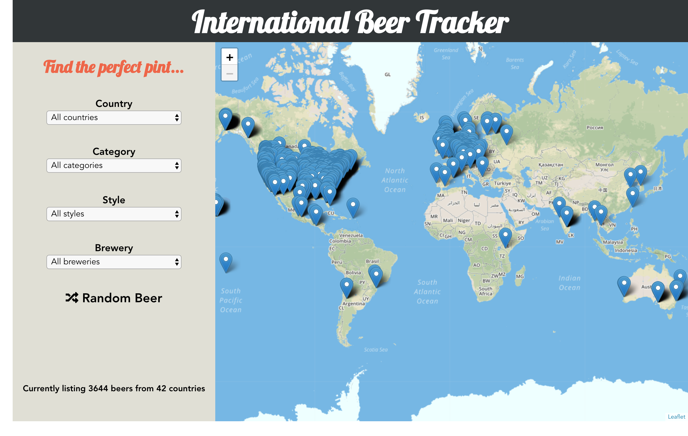
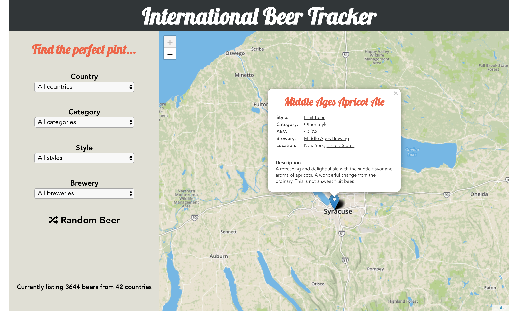
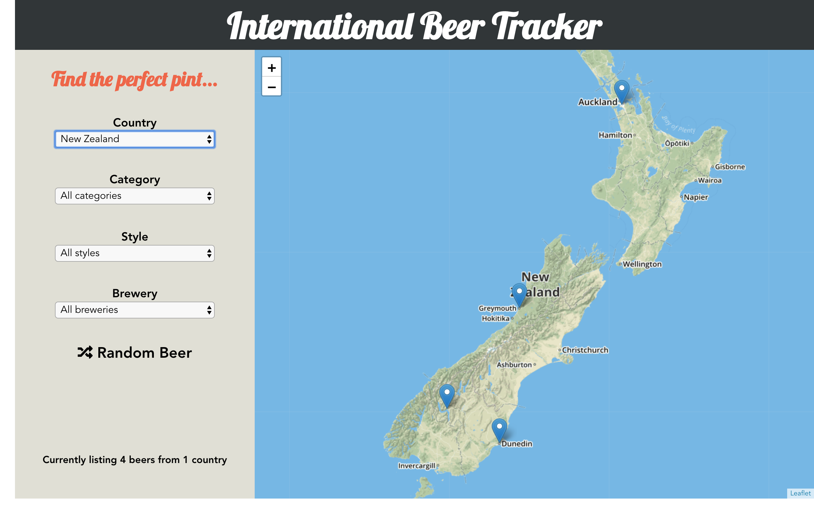
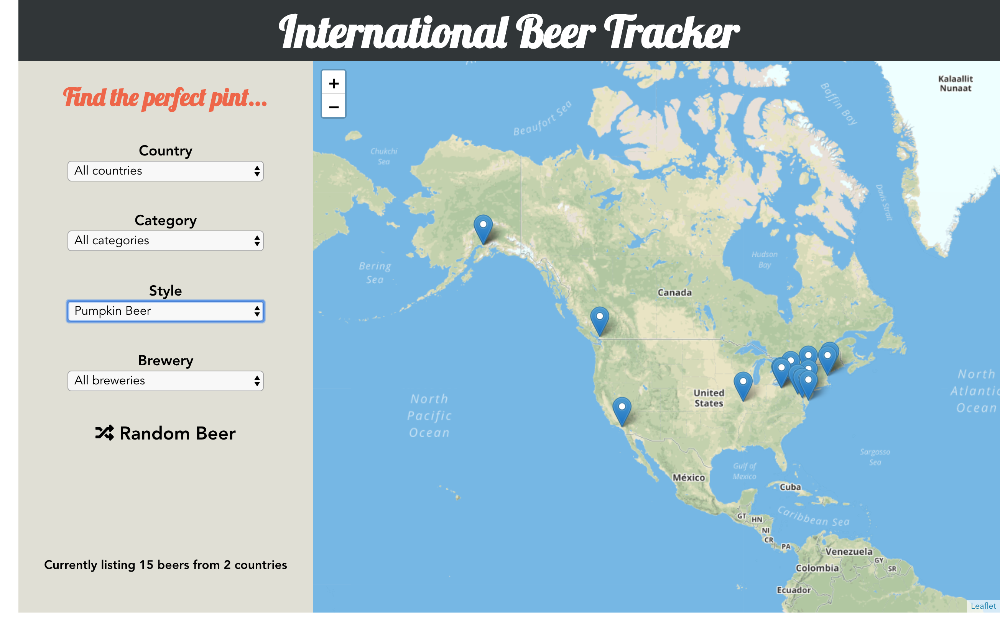
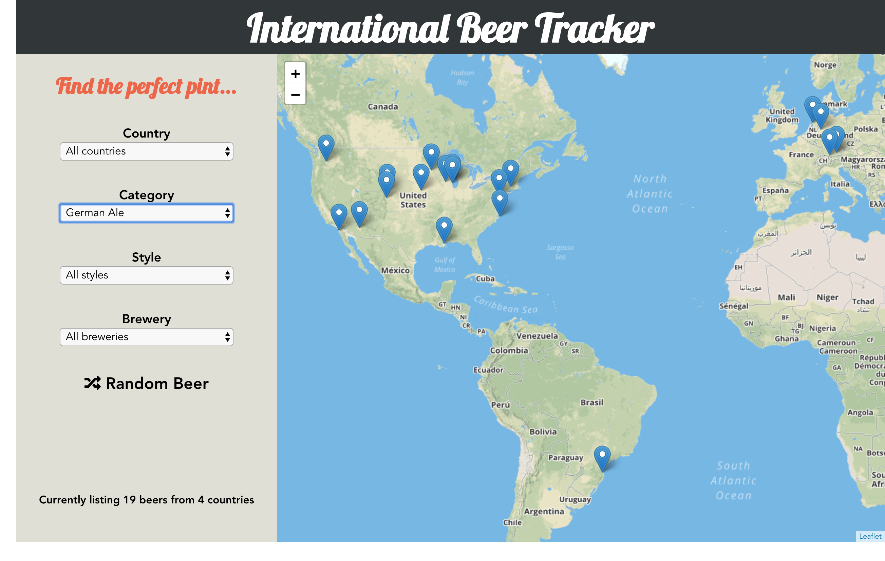
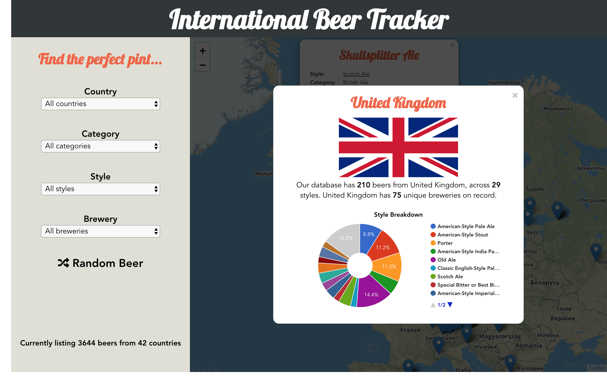
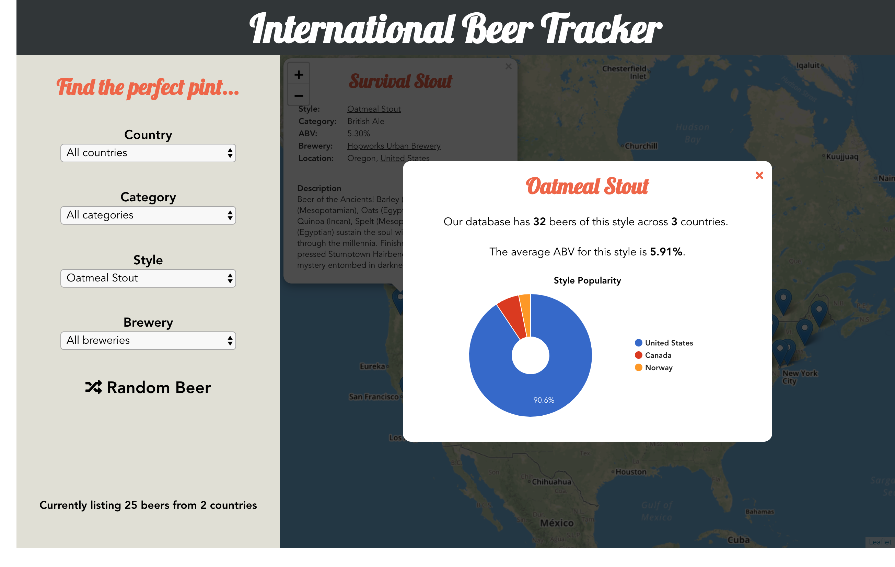
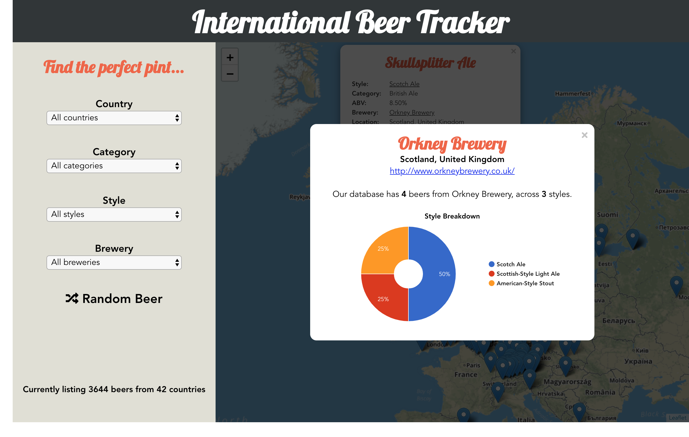

# International Beer Tracker
### [Live Demo](https://beertracker.surge.sh/)

### Track beers, breweries and worldwide beer trends in this JavaScript app.

Built in a weekend using [Vue](https://vuejs.org/), [Leaflet](https://leafletjs.com/), [Google Charts](https://developers.google.com/chart/), [Open Beer Database API](https://public-us.opendatasoft.com/explore/dataset/open-beer-database/information/) and the [RESTCountries API](https://restcountries.eu/).

Beers can be filtered on the map by style, category, country or brewery. A random beer can also be selected and the map will fly to that location. Further insight and analysis into these categories is given when a beer is clicked on.

### Features I'd like to implement in future -
* Search by beer description + name/country/category/style

* Suggest beers to a user

* "About" page on the app offering information about the project

* Heatmap/clusters to replace markers to allow better performance and use of a larger datatset

* A "Stats" for the entire dataset

### Screenshots

**Main Page**

**View details of an individual beer**

**Filter by country, style or category, with instant map refocusing**

**Access statistics and charts detailing beer styles, breweries and countries**

